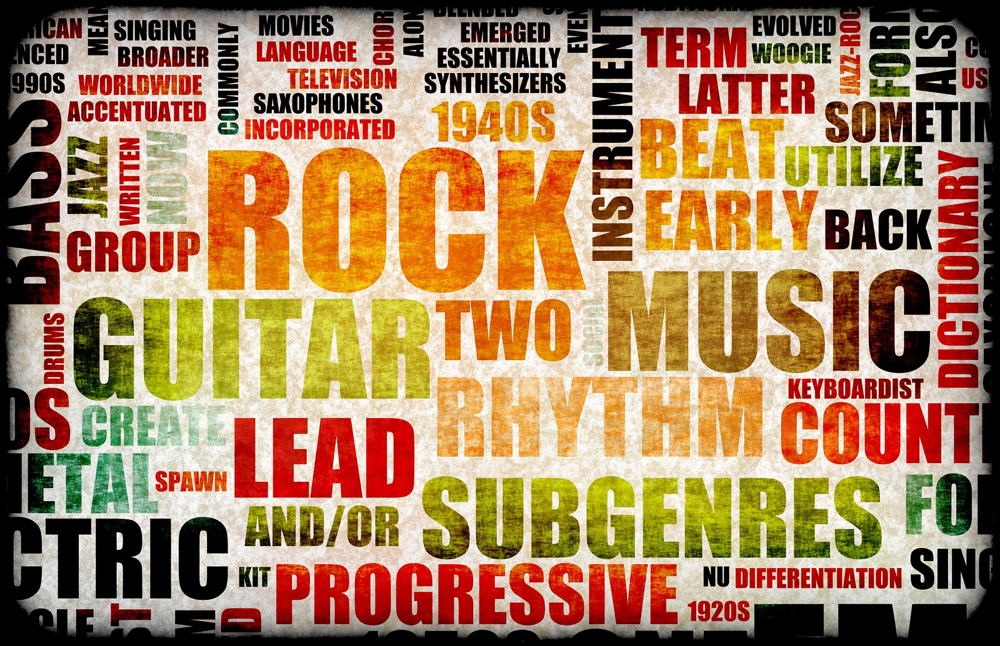
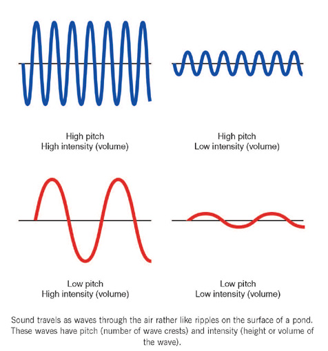
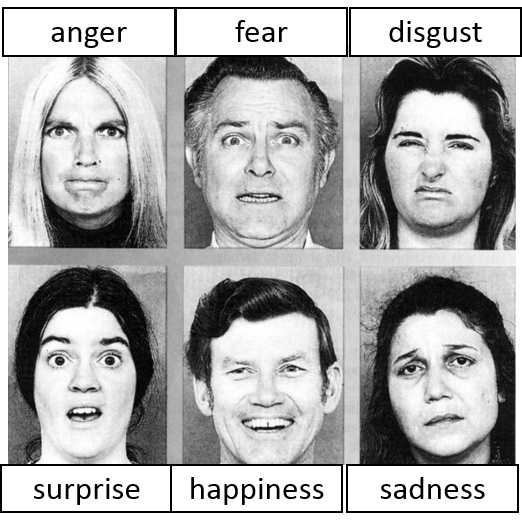
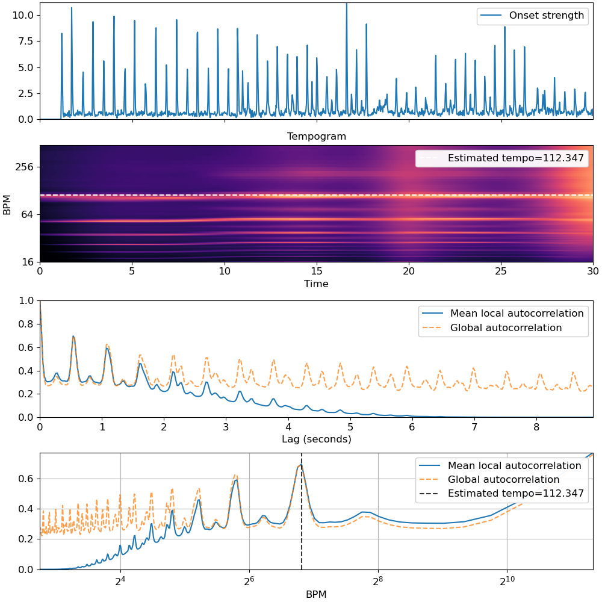
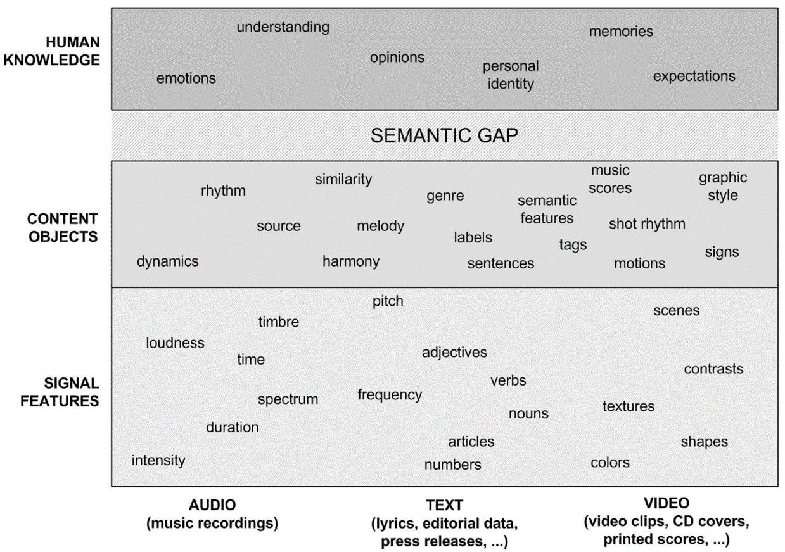
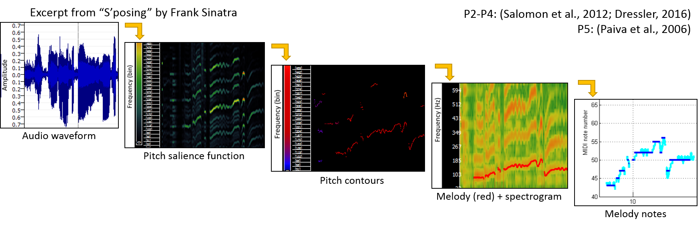
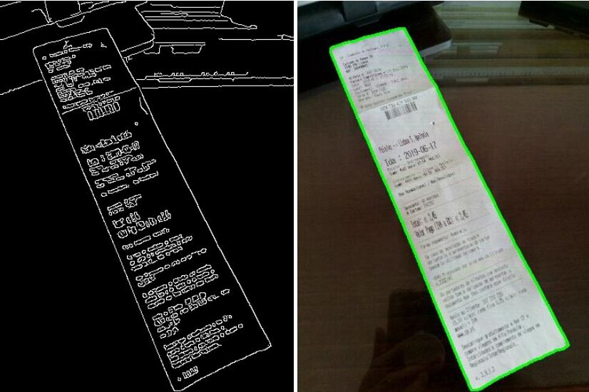
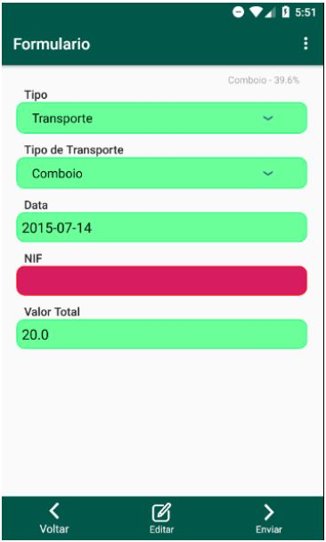
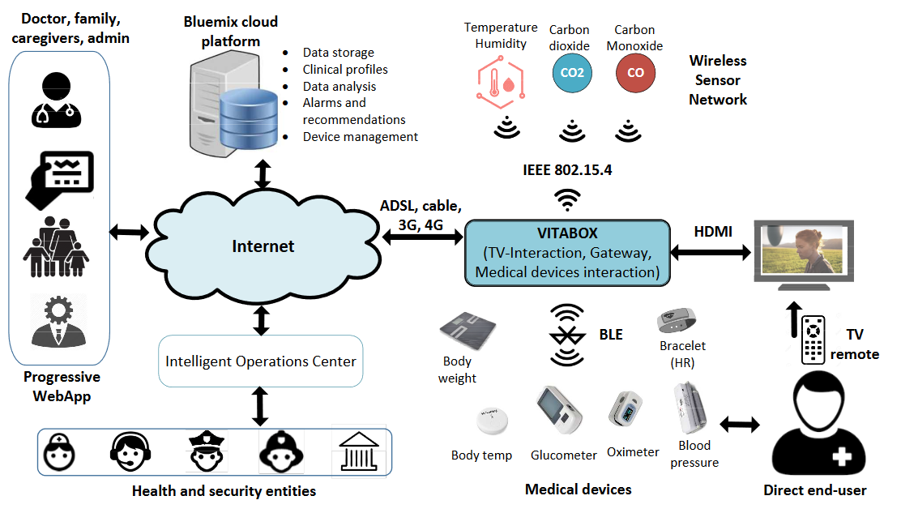

# About Me

Renato Panda, PhD 
I. Researcher @ Ci2.IPT 
C. Researcher @ CISUC (MIRlab) 

Research Interests:
<ul>
  <li>Emotion Recognition</li>
  <li>Information Retrieval</li>
  <li><i>Applied Machine Learning & Software Engineering</i></li>
</ul>

https://renatopanda.github.io

   

<aside class="notes">
Briefly, my name is RP.

My main research areas are emotion recognition and information retrieval in music.
Still, I also apply ML and advanced SE concepts to solve general problems an develop prototypes.
</aside>

# What is Music Information Retrieval?

The interdisciplinary science of retrieving information from music.
Small but growing field of research with many real-world applications.

<aside class="notes">
Starting with my main research field: MIR. It bridges several areas, where we try to automatically extract information from music (for instance audio signals).
</aside>

## Music Classification

 

Categorizing music items by genre, emotion, artist, and so on.

<aside class="notes">
This means, for example, automatic classification of songs by genre (e.g., rock), identify the artist, the emotion it carries and so on.
</aside>

## Music Recommendation (Spotify)

 

<aside class="notes">
A 2nd example are recommendation systems such as Spotify, which are able to guess what musics we enjoy (this uses more than MIR).

It's important to note that these are very complex and combine a myriad of techniques, from social data, to text, raw audio, curated data...
</aside>

## Music Source Separation and Recognition

 

<aside class="notes">
We have source separation, to split an original song into instruments or lines.
</aside>

## Automatic Music Transcription

 

<aside class="notes">
Converting an audio recording into its symbolic notation.
</aside>

## Audio Fingerprinting

 

<audio controls>
  <source src="./images/Dance Monkey Sample.mp3" type="audio/mpeg">
  Your browser does not support the audio tag.
</audio> 

<audio controls>
  <source src="./images/Dance Monkey Sample.mp3" type="audio/mpeg">
  Your browser does not support the audio tag.
</audio> 

<aside class="notes">
Audio fingerprinting, to recognize a song in seconds (even with noise) as with Shazam.
</aside>

## Music Search and Discover

<video data-autoplay src="./images/Google Hum to Search.mp4" controls></video>

<aside class="notes">
We have other search mechanisms such as query by humming, which is nowadays supported by Google Search.
</aside>

# What is Music Emotion Recognition?

Subfield of MIR that deals with emotion.

<aside class="notes">
Within this field we have a sub-field called MER that deals with the emotional content in music.
</aside>

# Why MER?

<aside class="notes">
And why is capturing emotion in music relevant?

Então porque é que eu tenho interesse em explorar a emoção que é transmitida por uma música?
</aside>

## The Information Age

Music distribution methods changed drastically in the last decades.

Streaming services provide millions of songs.

 
 
 

<aside class="notes">
In brief,in the last decades we went from buying music at a small local stores to streaming services with millions of songs available.
</aside>

## Information Overload

How do we browse such collections effectively?
 

<aside class="notes">
...and thus nowadays the typical search methods (artist, genre) are limited, making it harder to discover new music effectively.
</aside>

## What do we know about music?
Music has been with us since our prehistoric times, serving as kind of a "language of emotion".

Regarded as music’s primary purpose (Cooke, 1959), the “ultimate reason why humans engage with it” (Pannese et al., 2016).

 
 
 

<aside class="notes">
However, we know that music has always been connected to us, in the most diverse contexts (e.g. war, religion, entertainment).
Why? Because music works as a language to tell stories and express emotions.

Thus, the idea of capturing this emotion information and use it to recommend songs, in cinema and advertising, playlists, therapy...
</aside>

# How MER Works?

Bridges several different fields such as music theory, psychology and computer science (DSP and ML).

<aside class="notes">
How do we do this? It is a typical ML problem, that uses knowledge from distinct fields (music, psychology, computer science).
</aside>

# Music as in _Audio_? Lyrics? Scores?

<aside class="notes">
First, we select a type of data. In my case I work mostly with audio but also text (lyrics)...
</aside>

## What is Sound and Music?

 
 

 

<aside class="notes">
And audio or sounds are simply variations in air pressure, caused for instance by hitting a drum and making the membrane push the air around it creating sound waves.
</aside>

## Musical Notes & Wave Properties

<aside class="notes">
These sound waves have characteristics such as amplitude and frequency that define their notes and can be analysed with DSP.
</aside>

# Emotion and Emotion Taxonomies

<aside class="notes">
Next we delve into psychology to understand how can we classify emotions.
</aside>

## What is Emotion?
A short experience in response to a [musical] stimulus.

**Context and Subjectivity**   
Basic emotions are universal (Ekman, 1987)   
... but also subjective and context-dependent. 
We focus on *perceived* emotion (!= felt).

<aside class="notes">
Here, to simplify, we assume that emotion is a short experience in response to a musical stimulus.

This is one of the difficult parts in MER, because these experiences are:
* subjective - two persons can report different emotions
* context-dependent
</aside>

## How do we classify emotions?

Categorical Models
<ul>
  <li>Basic emotions (Ekman, 1992)</li>
  <li>Hevner’s adjective circle (Hevner, 1936)</li>
  <li>MIREX AMC Task (Hu et al., 2007)</li>
</ul>

   

<aside class="notes">
There are several taxonomies, normally divided into two approaches: categorical, using words to describe emotions - such as happy and sad.
</aside>

## How do we classify emotions?

Dimensional Models
<ul>
  <li>Russell’s model (Russell, 1980)</li>
    <small><ul>
      <li>Valence (pleasure-displeasure) and arousal</li>
    </ul></small>
  <li>Thayer’s model (Thayer, 1989)</li>
    <small><ul>
    <li>Energetic arousal vs. tense arousal</li>
    </ul></small>
</ul>

   

<aside class="notes">
And we have dimensional models, more complex, where emotions are points in, for example, a 2D plane with intensity and valence.
</aside>

<!-- ## Relations between Music and Emotions -->

<!-- 
 -->
<!-- Several associations have been found:    -->

<!-- * Articulation – overall (staccato/legato), variability  -->
<!-- * Melody – range (small/large), direction (up/down)  -->
<!-- * Rhythm – (regular-smooth/firm/flowing-fluent/irregular-rough)  -->
<!-- * Mode – (major/minor)  -->
<!-- * Dynamics – overall level, crescendo / diminuendo, accents -->
<!-- * Harmony – (consonant/complex-dissonant)  -->
<!-- 
 -->

<!-- <aside class="notes"> -->
<!-- Finally, still in musical psychology, we have some relations that are known between music and emotions. -->
<!-- E.g., we know that major modes are associated with happiness. -->

<!-- Por fim temos os estudos de psicologia musical, que relacionam algumas características musicais e emoção. Por exemplo dizem que sons alegres são mais simples e consonantes (com harmonia), que os modos maiores são também alegres e por aí fora. -->
<!-- </aside> -->

<!-- ## Relations between Music and Emotions -->

<!--  -->

<!-- > - Research results can be quite **inconsistent across studies** -->
<!-- > - Many musical concepts are **difficult to extract** -->
<!-- > - Some **require further research** (psychological perspective) -->

<!-- <aside class="notes"> -->
<!-- The main issue is that many of these studies are quite contradictory and there are few computational methods to extract these from the audio signal. -->

<!-- O problema é que estes estudos têm resultados algo inconsistentes e é bem difícil de pegar num sinal áudio, numa sequência de variações de pressão, e transformar aquilo numa das características anteriores... -->
<!-- </aside> -->

# MER and Machine Learning

<aside class="notes">
Finally we reach the ML part and apply it to MER (as in any other problem)
</aside>

## Machine Learning? Deep Learning?

 

<aside class="notes">
Nowadays we have traditional ML and deep learning.
It starts with a dataset, such as messages from twitter or songs.

Traditionally, we apply **handcrafted** algorithms to extract metrics from these examples: this could be the presence of bad words in a tweet, or the presence of guitars in a song. Then we apply some ML algorithms, to recognize patterns between these features and the labels.

Deep learning became an hot topic recently because it is able to learn features, eliminating the hardest part (**handcraft features**). It is only possible due to two things:
1. Immense amounts of data that some fields have (photos!)
2. Powerful GPUs

In MER we mostly use traditional methods because we lack large datasets.
</aside>

# Dataset Collection

<aside class="notes">
Regarding datasets...
</aside>

## MER Datasets
Most are very small (<1000 songs) or large (1M songs) but with low quality annotations (uncontrolled)

* 2018 - 4QAED, 900 clips, 4 classes (validated)
* 2016 - DEAM, 1802 songs, AV using MTurk (low quality)
* 2013 - MIREX-like, 903 songs (30-sec clips), 764 lyrics and 193 MIDI files, 5 classes (non-validated)
* 2012 - DEAP120, 120 song/videos + EEGs + biosignals + questionnaires, AV 
* 2011 - MSD, nearly 1 million song entries and features, Last.FM uncontrolled tags

<aside class="notes">
There are several but they are either too small (<1000 songs) or really large, such as the MSD, but with poor annotations from social media.
**Hence, it's hard to use DL in MER**

Your models will only be as good as your data.
 
Extra:
For instance, if you have a million song dataset of plants but many are wrongly labeled the relations that you can extract from the data will be wrong too.
</aside>

## Building a MER Dataset

 

<aside class="notes">
Thus, part of my work has been related with building datasets, organizing audio and annotations from online sources, processing and validating them.
</aside>

## Building a MER Dataset - Human Validation

<video data-autoplay src="./images/awa.mp4" controls></video>

<aside class="notes">
As an example, this is one of our prototypes used to listen and annotate emotions in songs.
</aside>

# Feature Extraction

<aside class="notes">
From the dataset we extract features.

In music this can be the song's duration, beats per minute or very abstract statistics.
</aside>

<!-- ## What is a Feature? -->
<!-- Describes a characteristic part of something.    -->

<!-- What distiguishes these persons? -->
<!--  -->

<!-- * For a song it could be the genre, its tempo, melody, or even more abstract metrics of the signal itself. -->

<!-- <aside class="notes"> -->
<!-- ... which are characteristics that allow to distinguish them. In music this can be the duration, beats per minute or very abstract statistics. -->

<!-- Como já vimos, uma features significa uma característica que permite distinguir os exemplos. Se pensarmos em pessoas? O que poderia ser uma feature? Podia ser o tamanho do cabelo, a cor da pele, a altura, se usa óculos, etc. -->
<!-- Ao falarmos de música, uma feature pode ser o género (ex. rock), as batidas por minuto, a duração, ou até podem ser coisas bastante abstractas relacionadas com o próprio sinal. -->
<!-- </aside> -->

## Zero Crossing Rate
A simple indicator of noisiness consists in counting the number of times the signal crosses the X-axis (or, in other words, changes sign).

<aside class="notes">
One simple example is the ZCR, it simply counts the number of times the signal passes 0.
</aside>

## Tempo and Tempogram

<aside class="notes">
Obviously, the most interesting are the higher-level ones that we (humans) associate with music, such as the estimation of tempo in beats per minute.
</aside>

<!-- # Data Preprocessing / Preparation -->

<!-- <aside class="notes"> -->
<!-- I will skip this part, which includes several steps applied to features: -->
<!-- * Clean invalid or empty values -->
<!-- * Selecting the most relevant -->
<!-- * Summarize complex representations (statistics) -->
<!-- </aside> -->

# Machine Learning

<aside class="notes">
Finally we apply ML algorithms to these sets of features and labels
</aside>

<!-- ## What is Supervised Learning in ML? -->
<!--  -->

<!-- > - How to select the right ML algorithm (and its parameters)? -->

<!-- <aside class="notes"> -->
<!-- The idea is simple but the problem is which method and parameter to use? -->

<!-- Aqui o princípio é simples, falando de aprendizagem supervisionada, nós começamos com um dataset anotado, por exemplo com imagens de bananas e maçãs. Pegamos nas features que representam esse dataset e usamos um algorítmo de ML. Esse algorítmo vai reconhecer um conjunto de padrões, de relações entre essas features. No fim, quando queremos classificar uma nova imagem vamos dar as features deste novo caso ao modelo, que usa as relações que descobriu para a classificar numa das classes anteriores. -->

<!-- No entanto isto levanta uma série de questões, entre elas... Como é que eu sei quão bom é o modelo que treinei antes de o aplicar em produção? -->
<!-- </aside> -->

## ML Algorithms

<aside class="notes">
These are just some examples of the existing ML algos, so how do we pick one? Which parameters do we use?
</aside>

## A: Hints & Experimentation

<aside class="notes">
Although there are some suggested paths, normally we test several configurations, assessing performance.

With DL it gets even more complicated, because the entire network needs to be designed and it is kind of an alchemy (type of networks, layers, activation)
</aside>

<!-- ## *K*-nearest Neighbors (KNN) - remove -->
<!-- Assigns a label based on most common class among its k nearest neighbors -->

<!--  -->

<!-- <aside class="notes"> -->
<!-- Um dos exemplos mais simples é o KNN, em que um novo exemplo é classificado com base nos K vizinhos mais próximos. Por exemplo, temos duas features (Y e X), duas classes. Chega um novo exemplo, é colocado no espaço e classificado com base na proximidade. Neste caso seria verde, classe B. -->
<!-- </aside> -->

<!-- ## *K*-nearest Neighbors (KNN) - remove -->
<!-- How to select the right *k*? -->

<!--  -->

<!-- * Larger *k* reduces the effect of the noise, but makes boundaries between classes less distinct -->
<!-- * Normally selected by experimentation (hyperparameter optimization) -->

<!-- <aside class="notes"> -->
<!-- Mesmo este algoritmo mais simples não é assim tão simples, como escolho o valor de K? Por norma é com base em experimentação. -->
<!-- </aside> -->

<!-- ## Traditional MER ML Workflow -->

<!-- <ol> -->
<!-- <li>Gather a dataset (e.g., audio + annotations)</li> -->
<!-- <li class="fragment">Extract features (e.g., using audio frameworks)</li> -->
<!-- <li class="fragment">Prepare data -->
<!--   <ul> -->
<!--     <li>Clean, transform, reduce/rank, scale</li> -->
<!--   </ul> -->
<!-- </li> -->
<!-- <li class="fragment">Test various ML algorithms and optimize parameters</li> -->
<!-- <li class="fragment">Gather results (Accuracy, F1-score, Confusion Matrix)</li> -->
<!-- <li class="fragment">[Production?] Train a final MER ML model</li> -->

<!-- <aside class="notes"> -->
<!-- In summary, we build a dataset, extract features, prepare the data, train several models and measure the results... and in the end we have a best model that can be included in a mobile app to classify new examples. -->

<!-- Resumindo, no caso de MER, a estratégia típica é: obter um dataset, extraír features, processar as mesmas, partir os dados, testar vários algorítmos e parametros, obter e analisar os resultados (com gráficos, valores, matrizes de confusão). Para um sistema final, usamos o que aprendemos para treinar um modelo final que melhor se comporte - isto é o que o Tiago António e o João Canoso têm estado a fazer, juntando-lhe SE avançada. -->
<!-- </aside> -->

# Novel Contributions

<aside class="notes">
Given this, our most relevant contributions have been the proposal novel features.
</aside>

<!-- ## Novel Contributions - remove? -->
<!-- 
 -->
<!-- 
 -->
<!--   -->
<!--   -->
<!-- <ul> -->
<!--   <li>New public datasets</li> -->
<!--   <li>Novel features to address -->
<!--   <ul> -->
<!--     <li>MER/MIR "glass ceiling"</li> -->
<!--     <li>Semantic gap</li> -->
<!--   </ul> -->
<!--   </li> -->
<!-- </ul> -->
<!-- 
 -->
<!-- 
 -->
<!--     -->
<!-- 
 -->
<!-- 
 -->

<!-- <aside class="notes"> -->
<!-- As maiores limitações actuais são a falta de datasets públicos e de qualidade, e o estagnar dos resultados de classificação, que é atribuído à falta de features de alto nível, ´próximas do que nós humanos usamos. As features áudio que mostrei andam por norma aqui em baixo. -->
<!-- </aside> -->

## Novel Emotionally-relevant Audio Features
 

<aside class="notes">
This started by studying the musical elements, then checking if the literature relates them with emotion and finally, verify which musical atributes are said to be relevante to emotion but lack computational algorithms.

Extra:
We've identified 3 dimensions (expressive techniques, texture and form) and proposed features for them.
</aside>

## From Audio Signal to Notes

 

<audio src="./images/sposing.wav" controls></audio>
<audio src="./images/sposing midi melody.wav" controls></audio>

Each extracted note contains: 
<ul>
<li>A sequence of f0s and saliences</li>
<li>Overall note (e.g., A4)</li>
<li>Note duration (sec)</li>
<li>Starting and ending time</li>
</ul>

<aside class="notes">
To capture these we estimate musical notes and their details (duration, strength) directly from the original audio signal
</aside>

## Novel Emotionally-Relevant Audio Features

* The notes’ data is exploited to model higher level concepts, e.g.,:
  * Musical Texture
     * Number of lines (thickness), transitions
  * Expressive techniques
     * Articulation
     * Glissando
     * Vibrato and Tremolo
  * Melody, dynamics and rhythm
     * Related with note pitch, intensity and duration statistics

* Also explored the voice-only signal in sad/happy songs

<aside class="notes">
... and use these to model several features, for instance the presence of vibrato, the articulation between notes and so on
</aside>

## Several Interesting Results

* Novel features significantly improve results (8.6%)
* High arousal songs are easier to classify
* Low arousal (calm happy vs. sad songs) are difficult
  * Voice-only signal seems relevant for these (sad vs calm)

<aside class="notes">
These helped to improve emotion classification. In addition, we uncovered several interesting hypotheses: e.g., the voice-only is a key factor in emotion when the songs are low in arousal (e.g. sad or calm), this is lost when mixed.
</aside>

## Ongoing Work
  - Audio/lyrics and Deep Learning
    - Emotion Classification
    - Transfer Learning
    - Data Augmentation
  - Two FCT projects approved (2021)
    - Music Emotion Recognition - Next Generation (PTDC/CCI-COM/3171/2021)
    - Playback the music of the brain - decoding emotions elicited by musical sounds in the human brain (EXPL/PSI-GER/0948/2021)
  - **Development of Software Prototypes**

<aside class="notes">
We are now exploring DL solutions, not only classification but also transfer learning and data augmentation. The core idea is similar to a person that is already good in a task (e.g. play violin), a thus will have an easier time learning another (e.g., play piano). For instance, starting with a model trained to recognize objects in millions of pictures (google!), and retrain it to classify plants.

Such topics will be explored in the upcoming years, thanks to 2 projects selected for funding.

**finally**, there is the development of prototypes and solutions and this leads me to...
</aside>

# Bridging Fundamental and Applied Research

<aside class="notes">
To conclude, I will briefly describe the application of ML and SE knowledge into different problems, developing working tools.
</aside>

## MER Web Concept
A distributed MER system **proof-of-concept** using **microservices**

<video data-autoplay src="./images/DockerMER.mp4" controls></video>

<aside class="notes">
Still regarding MER, in 2019 I challenged a few students to develop a proof-of-concept that automatically classifies the emotion in youtube music videos.

Goal to assess if a distributed MER system using microservices and message brokers could be implemented.
</aside>

## Monolith vs. Microservices

 

<aside class="notes">
This means instead of developing a large monolith of code, each task is carried by smaller, independent services that can be replicated and distributed to work in parallel.

Para os que nunca ouviram falar de microserviços. Assim por alto, em vez de usar a arquitectura típica, monolítica, em que têm um sistema com MVC ou UI+API, onde a API faz toda a lógica, a ideia é separar tudo em micro serviços, isolados e independentes, em que cada faz algo muito simples em paralelo.
</aside>

## MER Web Concept (Architecture)

 

<aside class="notes">
This was +- the idea, sorry the PT, it was simple with 3 services as a proof of concept.

A arquitectura era relativamente simples. A cinza temos ainda a clássica API + FE, só que depois toda a parte de MER são microserviços ligados por uma fila de mensagens. Com 3 serviços para obter o vídeo, extrair características e classificar.
</aside>

## EmoTube (WIP)

Complex MER platform fusing **audio** (raw signals), **lyrics** (text), source **separation**, signal **segmentation** and more. Built as containerized microservices (**docker**), with automated tests+builds, paralelization via **brokers**, orchestrated which **kubernetes**, deployed on private cloud.

 
João Canoso (MSc) 
<small>Cloud Architect / DevOps Engineer 
Full-Stack Developer</small>

 
Tiago António (MSc) 
<small>Machine Learning Engineer 
Full-Stack Developer</small>

<aside class="notes">
Given its success, I challenged two other students to build a robust version that will now deal with much more data, including audio and lyrics, separating the vocals from the audio, classifying the emotion in each (voice, audio, lyrics). All with state-of-the-art approaches in cloud computing.
</aside>

## EmoTube (WIP) Architecture
 

<aside class="notes">
This is the planned architecture, where each block is a different service communicating though a message broker. They are all independent, each with their simple task and know nothing about the others. E.g. this just receives an youtube URL, downloads the video and saves it to a file.

Portanto a arquitectura cresceu para isto (até já está algo diferente), em que cada bloco azul é um serviço diferente que pode ter várias cópias simultâneas em paralelo. O User no UI escolhe um vídeo e por aí fora...
</aside>

## Expenses-OCR

Mobile App using OCR to process invoices

<aside class="notes">
In a completely different direction, this was a problem introduced by a company: workers spending too much time introducing the travel expenses. So I supervised a few students to find a solution to this - a mobile app that can to take a picture of the invoice and parse data.
</aside>

## Expenses-OCR

<aside class="notes">
This included experimenting with edge detection and so on using OpenCV.
</aside>

## Expenses-OCR

<aside class="notes">
And in the end the text data was parsed and added to the form.
It also includes a bit of ML, in this case trying to identify the type of expense (i.e., train invoice) - mostly with text, next step was image because of logos.
</aside>

## VITASENIOR

Telehealth solution to monitor and improve health care for the elderly living in isolated areas

<aside class="notes">
There are other projects but I believe I'm out of time by now.
VITASENIOR was a funded research project to develp a telehealth solution to monitor elderly people living in isolated areas of PT.
It went from the hardware part of the sensors all the way to the cloud infrastructure - the later was supervised by me.
</aside>

## Others

MOVIDA, Strate App, MovTour

# Congratulations, you made it til the end!

<aside class="notes">
And that's it, hope I didn't bore you. This was a bit different than most presentations today but my key message is that some times solutions and inspiration come from exploring ideas already used in other fields. Thus I'm here to collaborate and discuss ideas with you.
